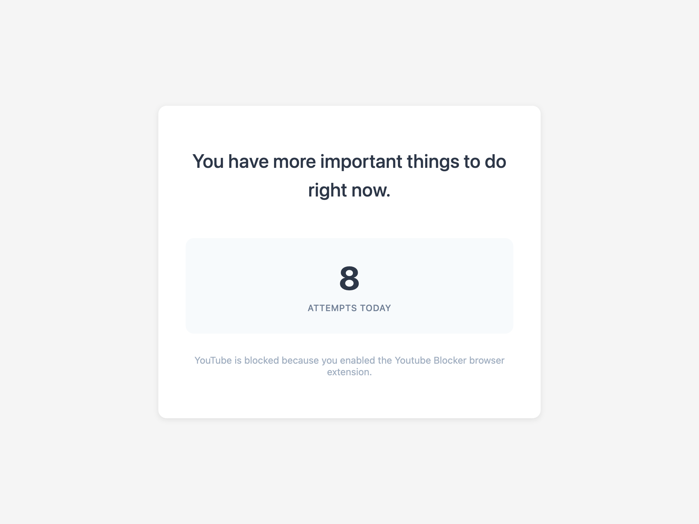

# YouTube Blocker Chrome Extension

A minimalist Chrome extension that blocks access to YouTube and tracks your access attempts.

## Features

-  Blocks access to youtube.com and www.youtube.com
-  Tracks daily access attempts
-  Displays random motivational messages on each block
-  Clean, minimalist interface
-  No bypass options - strict blocking

## Installation

1. Open Chrome and navigate to `chrome://extensions/`
2. Enable "Developer mode" (toggle in top-right corner)
3. Click "Load unpacked"
4. Select the `youtube-blocker` folder
5. The extension is now active!

## License

MIT